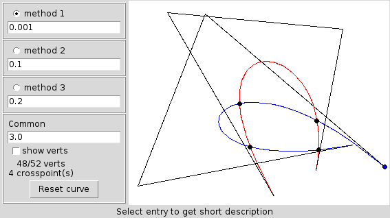

================================================================================
                            Graphics algorithms
================================================================================

Various graphics algorithms I learned. Mostly Python program using either
Tkinter or Python Imaging Library (PIL).

There are following library modules used by demo applications:

* ``utils2D.py`` --- different procedures work with segments, polygons etc.;
* ``aabb2D.py`` --- axis-aligned bounding boxes;
* ``isconvex.py`` --- procedures work with convex polygons;
* ``cbezier2D.py`` --- procedures work with cubic Bezier curves;
* convex hull algorithms: ``jarvis.py``, ``graham.py`` and ``quickhull.py``.

.. contents::

Tkinter events serializer
--------------------------------------------------

Most Tkinter-based script relies on ``tk.py``, it's my attempt to express
interactive tasks in an imperative way.

BSP tree demo (tkinter)
--------------------------------------------------------------------------------

**BSP-tree-tkdemo.py** allows to edit a polygon and represents it as
a BSP tree. Then a user may check if a point lies inside or outside
the drawn polygon using the tree.

Approximation of a Bezier curve (tkinter)
--------------------------------------------------------------------------------

**cbezier-as-tkdemo.py** use different metrics to approximate
a Bezier curve with polyline.

Intersection of Bezier curves (tkinter)
--------------------------------------------------------------------------------

**cbezier-cc-tkdemo.py** approximates curves with polylines,
then check intersection of polylines.

Find a convex hull using Graham algorithm (tkinter)
--------------------------------------------------------------------------------

**graham-tkdemo.py** calculates convex hull of point using Graham algorithm.

Sutherland-Hodgman --- clip a polygon against a convex polygon (tkinter)
--------------------------------------------------------------------------------

**polyintersect-tkdemo.py** allows to define two or more polygons and clip
them using Sutherland-Hodgman algorithm.

Exact bounding box of Tkinter "smooth curve" (tkinter)
--------------------------------------------------------------------------------

**tk_ebbox-demo.py** --- Tkinter uses Bezier splines to represent "smoothed
curves", however its method bbox returns the bounding box of control points.
This demo shows how to calculate an exact bounding box.

Clipping segment using Cohen-Sutherland algorithm (javascript + SVG)
--------------------------------------------------------------------------------

**Cohen_Sutherland-demo.svg** demonstrates the algorithm.

